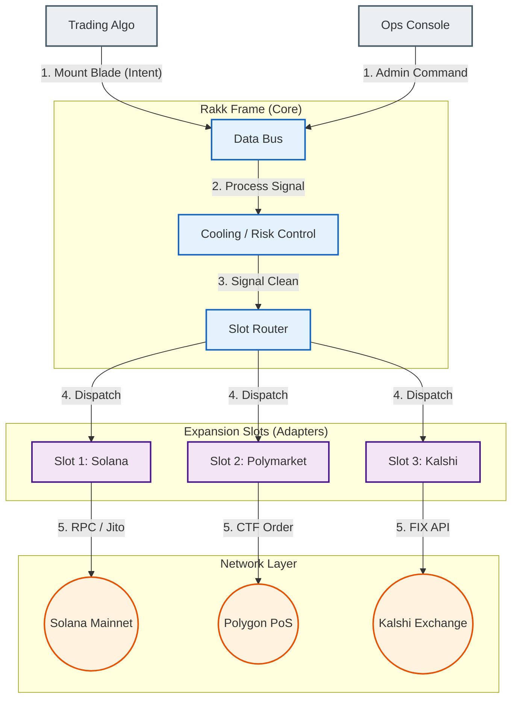

# Rakk

<div align="center">
  
  <br/>
  <br/>
  <a href="https://x.com/rakk_research">
  
</a>
  <a href="https://github.com/rakk-res">
    
  </a>
  
  
  
  <br/>
  <br/>
  <p><strong>High-density Execution Infrastructure for Algorithmic Agents.</strong></p>
  <p>Rakk provides a modular, rack-mounted middleware architecture where trading strategies are inserted as "Blades" and execution venues are managed via "Slots".</p>
</div>

---

## Architecture

Rakk mimics a physical server rack. The **Frame** manages power and data flow, routing signals from **Blades** (Intents) to the appropriate **Slots** (Adapters).



## Core Components

### 1. Frame (The Chassis)
The central nervous system that provides power (liquidity access) and cooling (risk management) to all connected components.
* **Bus**: High-speed, lock-free messaging channel using `crossbeam`.
* **Cooling**: Throttles execution if temperature (volatility/slippage) rises above critical levels.

### 2. Blades (The Logic)
Standardized containers for trade intents. Agents simply "slide" a Blade into the Frame to initiate execution. A Blade contains asset, side, size, and strategy parameters.

### 3. Slots (The Interface)
Hot-swappable modules for external connectivity using generic Traits.
* **Solana Slot**: Handles transaction signing and Jito bundle formation.
* **Polymarket Slot**: Abstracts CTF mechanics and CLOB interaction.

## Installation

```bash
# Clone the repository
git clone https://github.com/rakk-res/rakk.git
cd rakk

# Mount the frame (Build)
cargo build --release
```

## Configuration

Configuration is managed via `Rakk.toml` or environment variables.

```toml
[frame]
id = "ap-northeast-rack-01"
max_blades = 64

[cooling]
max_slippage_bps = 50
emergency_stop = false

[slots.solana]
rpc_url = "https://api.mainnet-beta.solana.com"
```

## Usage Example

### Mounting a Blade (SDK)

```rust
use rakk::prelude::*;

#[tokio::main]
async fn main() -> Result<()> {
    // 1. Initialize the Frame
    let frame = Frame::boot(Config::from_env()?);

    // 2. Define a Blade (Trade Intent)
    let blade = Blade::new()
        .target(Slot::Solana)
        .asset("SOL/USDC")
        .size(10.0)
        .side(Side::Buy);

    // 3. Mount into Frame
    let tx_hash = frame.mount(blade).await?;
    
    println!("Blade Executed. Hash: {}", tx_hash);
    Ok(())
}
```


## License

Distributed under the MIT License. See [LICENSE](./LICENSE) for more information.
